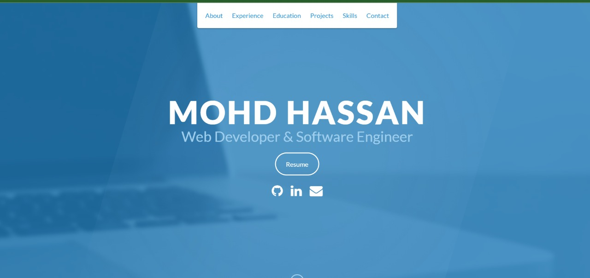

# 💼 mohd.hassan - Developer Portfolio

Welcome to my personal developer portfolio website!  
This portfolio showcases my skills, projects, and experience as a web developer.

## 🌐 Live Site
https://mohdhasan10.github.io/FUTURE_FS_01/

## 📌 Features

- 🧑‍💻 Clean, responsive design
- 📂 Sections: About, Projects, Skills, Experience, and Contact
- 🎨 Customized with animations and floating effects
- 🌐 GitHub, LinkedIn, and Email integrated for quick connection
- 📄 Downloadable resume
- 💻 Built with HTML5, CSS3, and a bit of JavaScript

---

## 📷 Screenshots



---

## 🚀 Getting Started

To run the portfolio locally:

```bash
git clone https://github.com/mohdhasan10/FUTURE_FS_01.git
cd FUTURE_FS_01
open index.html
```

## 🛠️ Technologies Used
- HTML5
- CSS3 (with animations and transitions)
- JavaScript (for interactions)
- Font Awesome (icons)
- Google Fonts

## 📫 Contact
Feel free to reach out:

- GitHub: [github.com/mohdhasan10](https://github.com/mohdhasan10)
- LinkedIn: [Connect with me on LinkedIn](https://www.linkedin.com/in/md-hasan)
- Email: mohd.hassan@gmail.com

## 📄 License
This project is licensed under the MIT License – feel free to use and customize it for your own portfolio!
